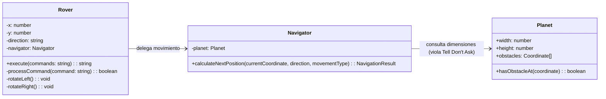
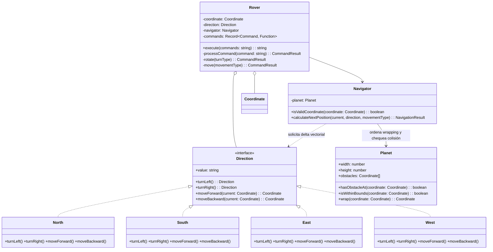
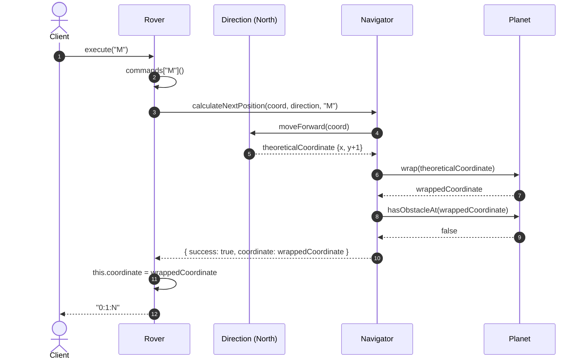

# Informe Técnico de Diseño de Software: Comparativa entre Versiones

- **Rama objetivo**: `development-ia`
- **Versión 1 (Línea base)**: Commit `f88546d3` (*docs: track tasks progress*)
- **Versión 2 (Evolución)**: Commit `1fbb11e4` (*test(refactor): add Command type and rotate method to Rover for symmetry and type safety*)

---

## 1. Resumen Ejecutivo

La evolución de **Versión 1** a **Versión 2** representa una transición profunda desde una **solución procedural orientada a clases** (con tipos primitivos y lógica distribuida en condicionales `if-else`) hacia un **diseño orientado a objetos clásico basado en polimorfismo, Value Objects y *Tell, Don't Ask***.

La Versión 2 mejora sustancialmente la cohesión, elimina la obsesión por tipos primitivos y encapsula la topología del planeta. No obstante, una evaluación técnica honesta también revela compromisos de diseño: introducción de complejidad accidental (violación moderada de YAGNI al crear una jerarquía de 4 clases para los puntos cardinales en TypeScript) y una desviación respecto a la estructura de directorios y contrato original del kata.

---

## 2. Análisis Detallado por Dimensiones de Diseño

### 2.1. Obsesión por Primitivos (Primitive Obsession) y Modelado de Dominio

* **Versión 1**:
  * `Rover` gestionaba el estado mediante variables escalares sueltas: `private x: number`, `private y: number` y `private direction: string`.
  * Los comandos recibidos en `execute(commands: string)` eran procesados carácter por carácter sin validar si pertenecían a un conjunto cerrado.
  * `Coordinate` era un tipo auxiliar declarado incidentalmente dentro del archivo del navegador (`Navigator.ts`).
* **Versión 2**:
  * Se extrae `Coordinate` como tipo de primer orden en `Coordinate.ts`.
  * La dirección deja de ser un `string` para convertirse en la interfaz polimórfica `Direction`.
  * Se modela el tipo unión `Command = 'L' | 'R' | 'M' | 'B'` y se complementa con un *Type Guard* (`isCommand`), blindando el sistema en tiempo de compilación y ejecución.

### 2.2. Polimorfismo vs. Condicionales (*Replace Conditional with Polymorphism*)

* **Versión 1**:
  * Para **rotar**, `Rover` implementaba escaleras `if-else` en `rotateLeft()` y `rotateRight()`, cambiando el string `this.direction`.
  * Para **trasladarse**, `Navigator` ejecutaba otro bloque `if-else` sumando/restando `1` a `x` o `y` según el string de la dirección.
  * Existía **duplicación de conocimiento conceptual**: dos clases distintas necesitaban saber qué significaba cada letra cardinal.
* **Versión 2**:
  * Se implementa el patrón Estado/Estrategia con 4 clases (`North`, `South`, `East`, `West`) que implementan `Direction`.
  * Cada clase encapsula sus propias transiciones angulares (`turnLeft()`, `turnRight()`) y sus deltas vectoriales (`moveForward()`, `moveBackward()`).
  * Los condicionales en `Navigator` y `Rover` quedan completamente erradicados.

### 2.3. Distribución de Responsabilidades y Ley de Deméter (*Tell, Don't Ask*)

* **Versión 1**:
  * `Planet` era un modelo anémico: solo exponía sus dimensiones públicas (`width`, `height`) y comprobaba obstáculos.
  * `Navigator` violaba el principio *Tell, Don't Ask*: interrogaba las dimensiones de `Planet` y calculaba externamente la envoltura esférica/toroidal (`if (y >= this.planet.height) y = 0`).
* **Versión 2**:
  * `Planet` se convierte en el **Information Expert** de la superficie marciana: incorpora los métodos `wrap(coordinate: Coordinate)` e `isWithinBounds(coordinate: Coordinate)`.
  * `Navigator` ahora "ordena" a `Planet` envolver la coordenada sin preocuparse por la aritmética de límites.

### 2.4. Despacho de Comandos y Manejo de Errores

* **Versión 1**:
  * Despacho manual con `if-else` en `processCommand(command: string)`.
  * Silencio ante entradas inválidas: cualquier carácter desconocido (ej. `'X'`) devolvía `true` y se ignoraba silenciosamente.
  * No existía validación de límites al instanciar el Rover (podía crearse en coordenadas imposibles como `(100, 100)`).
* **Versión 2**:
  * Despacho declarativo mediante diccionario de acciones: `Record<Command, () => CommandResult>`.
  * Validación defensiva en constructor: si la coordenada inicial está fuera del planeta, lanza `Position out of bounds`.
  * Comandos no válidos son detectados de inmediato y devuelven `{ success: false, reason: 'INVALID_COMMAND' }`.

---

## 3. Diagramas Arquitectónicos y de Colaboración

### 3.1. Diagrama de Clases: Versión 1 vs. Versión 2

#### Versión 1 (`f88546d3`): Modelo Anémico y Acoplamiento



#### Versión 2 (`1fbb11e4`): Polimorfismo, Value Objects y Encapsulación



---

### 3.2. Diagrama de Secuencia: Flujo de Movimiento (Versión 2)



---

## 4. Tabla Comparativa Exhaustiva

| Dimensión de Diseño | Versión 1 (`f88546d3`) | Versión 2 (`1fbb11e4`) | Veredicto Técnico |
| :--- | :--- | :--- | :--- |
| **Obsesión por Primitivos** | **Alta**: `x`, `y`, `direction` y comandos eran tipos primitivos (`number`, `string`). | **Baja**: Introducción de `Coordinate`, `Direction` y `Command`. | 🟢 **V2 es superior**: Mayor *type-safety* y expresividad. |
| **Control de Flujo** | Procedural: Múltiples escaleras `if-else` en `Rover` y `Navigator`. | Declarativo/Polimórfico: Despacho por tabla en `Rover` y polimorfismo en `Direction`. | 🟢 **V2 es superior**: Complejidad ciclomática reducida drásticamente. |
| **Principio SRP (Única Responsabilidad)** | `Navigator` calculaba deltas, envolvía bordes y detectaba obstáculos. | `Direction` traslada; `Planet` envuelve y valida; `Navigator` solo coordina. | 🟢 **V2 es superior**: Responsabilidades nítidamente delimitadas. |
| **Ley de Deméter & Tell, Don't Ask** | `Navigator` leía `planet.width` y `planet.height` directamente. | `Navigator` invoca `planet.wrap()` y `planet.isWithinBounds()`. | 🟢 **V2 es superior**: Respeta la encapsulación de `Planet`. |
| **Principio Abierto/Cerrado (OCP)** | Modificar direcciones o comandos requería editar ramas `if-else`. | Añadir comandos o direcciones se hace agregando clases o claves en el mapa. | 🟢 **V2 es superior**: Extensible sin tocar código existente. |
| **Robustez y Validación** | Permitía crear rovers fuera del mapa. Ignoraba comandos no soportados. | Falla en construcción si está fuera del mapa. Informa `INVALID_COMMAND`. | 🟢 **V2 es superior**: Comportamiento determinista y seguro ante fallos. |
| **Simplicidad & YAGNI** | **Alta simplicidad**: 3 archivos de producción, 108 líneas de código en total. | **Complejidad moderada**: 5 archivos, 211 líneas (+95% de código). Jerarquía de 4 clases para direcciones. | 🟡 **V1 era más simple**: V2 incurre en cierta sobreingeniería (ver sección 5). |
| **Estructura de Carpetas & Estándares** | Alineada con `testing-standards.md` (`src/core/domain/` y `src/core/tests/unit/`). | Aplanada a `src/core/` y `src/tests/`. | 🔴 **V1 respetaba mejor los estándares** documentados del repositorio. |
| **Contrato del Kata** | Salida estándar ante obstáculo: `"O:0:1:N"`. | Modifica la salida ante obstáculo a: `"OBSTACLE:0:1:N"`. | 🔴 **V2 alteró el contrato**: Rompe retrocompatibilidad con la especificación original. |
| **Cobertura de Pruebas** | 23 pruebas centradas en `Rover` y `Navigator`. | 49 pruebas unitarias exhaustivas aisladas por componente. | 🟢 **V2 es superior**: Pruebas más granulares y rápidas (140 ms). |

---

## 5. Crítica Técnica Honesta: Luces y Sombras

### 🟢 Aspectos Positivos Destacables en Versión 2
1. **Modelado Geométrico en `Planet`**: El cambio de delegar el cálculo de los bordes toroidales a `Planet.wrap()` es impecable desde la perspectiva del diseño orientado a objetos. Nadie mejor que el propio planeta para saber cómo se pliega su superficie.
2. **Eliminación de la Duplicación de Lógica de Dirección**: En la Versión 1, el conocimiento de los puntos cardinales estaba bifurcado (`Rover` sabía cómo rotar entre ellos, pero `Navigator` sabía hacia dónde apuntaba el vector unitario). Centralizar esto en `Direction` eliminó esa fuga de conocimiento.
3. **Manejo Explicito de Resultados**: Reemplazar flags booleanos (`let obstacleHit = false;`) por un tipo explícito `CommandResult` con causas tipadas (`OBSTACLE`, `INVALID_COMMAND`) aporta robustez profesional.

### 🔴 Puntos Débiles y Áreas de Mejora en Versión 2
1. **Sobreingeniería en `Direction` (Violación de YAGNI frente al enfoque funcional de TypeScript)**:
   * Implementar 4 clases concretas (`North`, `South`, `East`, `West`) que instancian nuevos objetos en cada giro es un patrón típicamente Java/C++ que añade 86 líneas de código.
   * En TypeScript moderno y siguiendo el principio de *Simple Design* (mínimo número de elementos), este problema se resuelve de forma inmutable, sin condicionales y en solo 15 líneas mediante dos tablas de búsqueda (lookups):
     ```typescript
     const ROTATIONS = {
       N: { L: 'W', R: 'E' },
       S: { L: 'E', R: 'W' },
       E: { L: 'N', R: 'S' },
       W: { L: 'S', R: 'N' },
     } as const;

     const VECTORS: Record<DirectionKey, Coordinate> = {
       N: { x: 0, y: 1 },
       S: { x: 0, y: -1 },
       E: { x: 1, y: 0 },
       W: { x: -1, y: 0 },
     };
     ```
   * Esta alternativa ofrece idéntica seguridad de tipos, cero condicionales, no requiere instanciación continua de objetos y reduce la sobrecarga cognitiva.
2. **Ruptura de la Convención de Carpetas (`testing-standards.md`)**:
   * En el commit `dbd456e`, se movieron los tests desde `src/core/tests/unit/` a `src/tests/`. La regla documentada en `.agents/rules/testing-standards.md` exige explícitamente:
     ```
     src/[module-name]/tests/
     ├── unit/
     ├── integration/
     └── e2e/
     ```
   * Aunque aplanar las carpetas redujo la anidación en un proyecto pequeño, contradice la directriz establecida del repositorio.
3. **Modificación del Contrato de Salida**:
   * Cambiar el prefijo de reporte de `"O:"` a `"OBSTACLE:"` en el commit `46c3a55` modificó una prueba existente para hacer pasar el código, lo cual choca con la regla de oro de `testing-standards.md` (*"Fix the implementation when a test fails, not the test"*), a menos que respondiera a un cambio explícito de requerimiento del cliente.

---

## 6. Conclusión

La **Versión 2 (`1fbb11e4`) es sustancialmente más madura, mantenible y robusta** que la Versión 1 (`f88546d3`) en términos de arquitectura de software pura, desacoplamiento y adherencia a SOLID y Tell, Don't Ask.

El único coste pagado ha sido un ligero exceso de formalismo ceremonial en la jerarquía de clases de `Direction` (fácilmente simplificable mediante tablas declarativas) y una reorganización de rutas de ficheros que convendría volver a alinear con el estándar hexagonal del repositorio.
