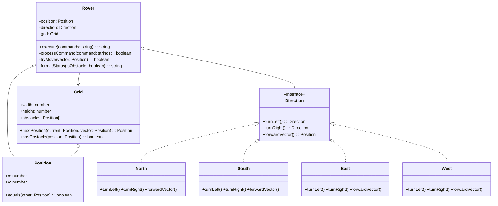
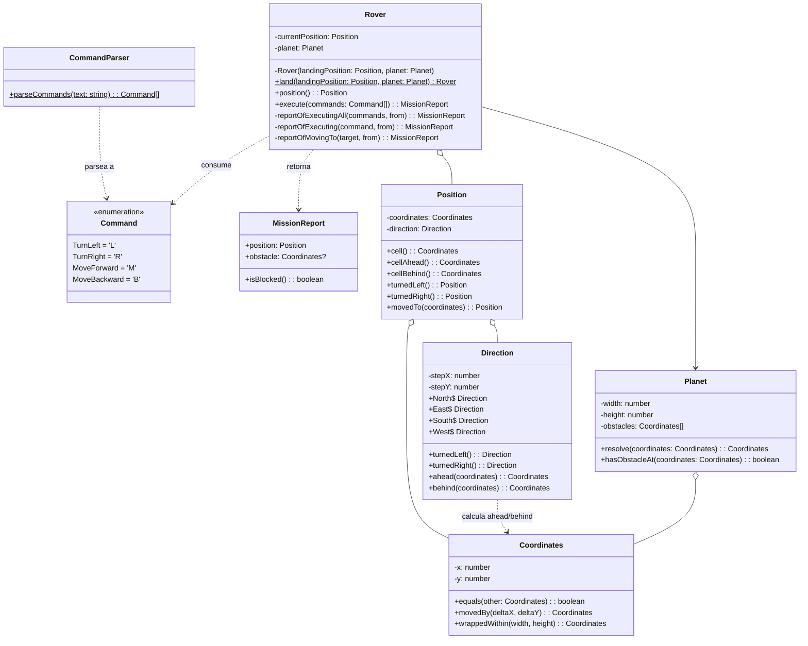

# Informe Técnico de Diseño de Software: Comparativa entre Ramas

- **Versión 1**: Rama `development-gemini-pro31` (Commit `e1514ced`)
- **Versión 2**: Rama `development-claudecode` (Commit `f01aa36`, actualizado en disco)

---

## 1. Resumen Ejecutivo

Con los cambios actualizados en el disco tras el `git pull`, ambas ramas presentan **implementaciones completas, funcionales y verificadas con pruebas automatizadas** desarrolladas mediante TDD riguroso. Sin embargo, difieren notablemente en sus decisiones de modelado, diseño en las fronteras del sistema y nivel de abstracción:

1. **`development-gemini-pro31` (Diseño Orientado a Objetos Clásico & API Basada en Strings)**:
   * **Alcance**: 18 tests unitarios pasando en `src/core/rover/tests/unit/`.
   * **Enfoque de Modelado**: Resuelve las rotaciones mediante el **patrón Estado / Polimorfismo clásico** (interfaz `Direction` y 4 clases concretas `North`, `South`, `East`, `West`).
   * **Frontera y Contrato**: La API pública del Rover opera directamente sobre strings (`execute(commands: string): string`), serializa el resultado en la propia entidad e ignora silenciosamente caracteres no reconocidos.
   * **Compromiso frágil**: Utiliza reflexión (`constructor.name.charAt(0)`) para inferir la letra cardinal en el reporte final, lo que es vulnerable a minificadores de código.

2. **`development-claudecode` (Diseño Guiado por el Dominio Rico, Anti-Corruption Layer & Value Objects)**:
   * **Alcance**: 47 tests unitarios pasando en `src/core/tests/unit/` (+ 1 scaffold) con cobertura exhaustiva de casos límite y topología esférica.
   * **Enfoque de Modelado**: Jerarquía nítida de Value Objects inmutables (`Coordinates`, `Direction`, `Position`, `MissionReport`). `Direction` utiliza un anillo horario estático (*Clockwise Ring*) con aritmética modular sin crear subclases ni usar condicionales.
   * **Frontera y Contrato**: Aplica *Parse, don't validate*. Separa el parseo (`CommandParser`) de la ejecución del dominio. El Rover solo acepta tipos seguros `Command[]` y retorna un objeto de dominio estructurado `MissionReport`.
   * **Robustez Defensiva**: Constructor privado con factoría estática (`Rover.land`), normalización de coordenadas en la esfera ("en una esfera no hay fuera") y rechazo atómico si la casilla de aterrizaje está ocupada por un obstáculo.

---

## 2. Análisis Detallado de Diseño de Software

### 2.1. Modelado de Dirección y Rotaciones

* **`gemini-pro31` (Polimorfismo / 4 Clases de Estado)**:
  * Crea una interfaz `Direction` y 4 subclases (`North`, `South`, `East`, `West`).
  * Cada clase retorna una nueva instancia al girar (`turnLeft()`, `turnRight()`) y define su `forwardVector(): Position`.
  * Para retroceder, `Rover` invierte el vector manualmente: `new Position(-forward.x, -forward.y)`.
  * 🔴 **Defecto de diseño**: Obtiene la letra cardinal mediante `this.direction.constructor.name.charAt(0)`. En un entorno empaquetado/minificado (esbuild, terser), las clases se renombran (ej. `class a`), corrompiendo la salida esperada.

* **`claudecode` (Value Object Inmutable con Anillo Estático)**:
  * Una sola clase `Direction` con 4 instancias estáticas inmutables: `Direction.North`, `East`, `South`, `West`.
  * Encapsula los vectores unitarios `stepX` y `stepY`.
  * La rotación se realiza sobre un array circular ordenado (`clockwiseRing`) mediante módulo:
    ```typescript
    private rotatedBy(quarterTurns: number): Direction {
      const ring = Direction.clockwiseRing;
      const positionInRing = (ring.indexOf(this) + quarterTurns + ring.length) % ring.length;
      return ring[positionInRing];
    }
    ```
  * Expone simétricamente `ahead(coordinates)` y `behind(coordinates)`.
  * 🟢 **Veredicto**: `claudecode` elimina la sobreingeniería de 4 clases, evita la reflexión, es 100% inmutable y ofrece una semántica vectorial impecable.

---

### 2.2. Manejo de Frontera y Validación de Comandos (*Parse, Don't Validate*)

* **`gemini-pro31` (Tolerancia Procedural dentro de la Entidad)**:
  * `Rover.execute(commands: string)` recibe un string plano.
  * Itera carácter a carácter; ante un carácter desconocido (ej. `'X'`), `processCommand` devuelve `false`, ignorándolo silenciosamente y permitiendo que el Rover continúe moviéndose con los comandos posteriores.
  * 🔴 **Violación de cohesión**: La entidad de dominio se encarga del bucle de parseo y tolera ejecuciones parciales inconsistentes.

* **`claudecode` (Anti-Corruption Layer en Frontera)**:
  * El dominio define el enum `Command { TurnLeft = 'L', TurnRight = 'R', MoveForward = 'M', MoveBackward = 'B' }`.
  * La función de frontera `parseCommands(text: string): Command[]` valida cada carácter contra el enum.
  * Si la entrada contiene cualquier carácter inválido (incluyendo minúsculas como `'m'` o sinónimos no soportados como `'F'`), **falla inmediatamente lanzando excepción** (`Unknown command 'X'`).
  * 🟢 **Veredicto**: El Rover nunca ve strings crudos ni ejecuta secuencias a medias. Toda la entrada queda validada y tipada antes de alcanzar la capa de dominio.

---

### 2.3. Contrato de Salida: Strings vs. Objetos de Dominio

* **`gemini-pro31` (Stringly-Typed)**:
  * `execute()` devuelve directamente `"x:y:D"` o `"O:x:y:D"`.
  * Mezcla la lógica de negocio con la presentación en texto plano. Si un cliente necesita las coordenadas finales o el obstáculo como datos estructurados, debe volver a parsear el string con regex o `split(':')`.

* **`claudecode` (Reporte de Misión Estructurado)**:
  * `Rover.execute(commands: Command[]): MissionReport` devuelve una entidad de resultado:
    ```typescript
    export class MissionReport {
      constructor(
        public readonly position: Position,
        public readonly obstacle?: Coordinates
      ) {}

      isBlocked(): boolean {
        return this.obstacle !== undefined;
      }
    }
    ```
  * Trata el obstáculo como un resultado de negocio legítimo, no como un string prefijado ni como una excepción.
  * La presentación textual queda completamente desacoplada del modelo de dominio.

---

### 2.4. Colocación, Aterrizaje y Topología Esférica

* **`gemini-pro31` (`Grid`)**:
  * Constructor público directo `new Rover(position, direction, grid)`.
  * Permite crear rovers fuera del mapa o sobre casillas que contienen obstáculos sin advertencia alguna.
  * `Grid` encapsula el cálculo de destino en `nextPosition(current, vector)`.

* **`claudecode` (`Planet` & `Rover.land`)**:
  * Constructor privado; el acceso es únicamente a través de la factoría `Rover.land(landingPosition, planet)`.
  * **Topología esférica coherente**: *"En una esfera no hay fuera"*. Si el rover se sitúa en coordenadas mayores que el ancho o negativas, `Planet.resolve()` las normaliza mediante wrapping.
  * **Obstáculos pre-normalizados**: `Planet` normaliza sus obstáculos en el constructor (`this.obstacles = obstacles.map(o => o.wrappedWithin(width, height))`). Si un obstáculo se declara fuera de los límites numéricos, se posiciona en la celda correspondiente del mapa.
  * Si la casilla de aterrizaje está ocupada por un obstáculo, `Rover.land` lanza una excepción (`Cannot land on a cell occupied by an obstacle`).

---

## 3. Diagramas Arquitectónicos Comparativos

### 3.1. Arquitectura de `development-gemini-pro31`



---

### 3.2. Arquitectura de `development-claudecode`



---

## 4. Tabla Comparativa de Diseño e Ingeniería

| Dimensión de Diseño | `development-gemini-pro31` (V1) | `development-claudecode` (V2) | Veredicto Técnico |
| :--- | :--- | :--- | :--- |
| **Modelado de Dirección** | Jerarquía polimórfica (4 clases concretas). Usa reflexión para serializar. | Value Object inmutable único con anillo horario modular. Cero reflexión. | 🟢 **V2 es inmensamente superior**: Más limpio, seguro y eficiente. |
| **Modelado de Coordenadas y Posición** | `Position` almacena solo `x` e `y`. La dirección se orquesta en `Rover`. | Desacopla `Coordinates` (aritmética/wrapping) de `Position` (Pose geométrica). | 🟢 **V2 tiene mayor cohesión matemática**. |
| **Frontera de Entrada** | String crudo en `Rover.execute()`. Comandos inválidos ignorados silenciosamente. | `parseCommands` atómico en frontera. Falla rápido ante cualquier carácter inválido. | 🟢 **V2 cumple *Parse, don't validate***. |
| **Modelo de Reporte / Salida** | String concatenado (`"x:y:D"` / `"O:x:y:D"`). Acoplado a presentación. | `MissionReport` estructurado (`Position` + `Coordinates?`). Desacoplado de UI. | 🟢 **V2 permite composición y extensibilidad**. |
| **Inicialización y Seguridad** | Constructor público sin validación de límites ni obstáculos. | Factoría estática `Rover.land()` con constructor privado y guarda ante colisión. | 🟢 **V2 protege los invariantes del dominio**. |
| **Topología y Obstáculos** | `Grid` normaliza solo al moverse. Obstáculos fuera de límites no se envuelven. | `Planet` normaliza obstáculos en construcción y coordenadas en cualquier punto. | 🟢 **V2 tiene un modelo topológico completo**. |
| **Cobertura y Especificación de Tests** | 18 tests en 7 archivos. Pruebas directas de estado. | 47 tests en 7 archivos de dominio. Nombres que especifican reglas de negocio. | 🟢 **V2 cubre muchos más casos límite**. |
| **Estructura de Carpetas & Hexágono** | Subcarpeta `src/core/rover/` con `tests/unit/`. Cero dependencias externas. | `src/core/` con `tests/unit/`. Cero dependencias externas. | 🟡 Empate técnico (ambas cumplen aislamiento). |
| **Documentación y Proceso** | Commits TDD atómicos limpios. | OpenSpec completo (`specs/`, BDD GIVEN/WHEN/THEN, `design.md`, `tasks.md`). | 🟢 **V2 cuenta con documentación exhaustiva**. |

---

## 5. Crítica Técnica Honesta: Luces y Sombras

### 🟢 Fortalezas de `development-claudecode`
1. **Separación de Responsabilidades Impecable**: `Coordinates` sabe de números y deltas; `Direction` sabe de puntos cardinales y giros; `Position` combina ambos para definir la celda delante/detrás; `Planet` conoce el terreno y sus accidentes; `Rover` orquesta. Cada clase cumple estrictamente SRP.
2. **Defensa en la Frontera**: El uso de `parseCommands` garantiza que ningún dato malformado entre en contacto con las entidades del dominio.
3. **Calidad de los Tests como Especificación**: Las aserciones leen como requerimientos de negocio (`The Rover > stops on the last free cell when an obstacle blocks its advance`) en lugar de pruebas mecánicas de funciones.
4. **Ausencia de Reflejos o Trucos de Runtime**: El código es 100% tipado estáticamente, sin acceder a `constructor.name` ni propiedades mágicas.

### 🔴 Áreas de Mejora en `development-claudecode`
1. **Complejidad de Clases para una Kata Pequeña**: Disponer de `Coordinates`, `Position`, `Direction`, `MissionReport`, `Planet`, `Rover` y `Command` (7 abstracciones) puede percibirse como una arquitectura sobrediseñada para un problema contenido, aunque es un diseño preparado para escalar a una aplicación empresarial real.
2. **Desviación del Enunciado Literal en la Salida**: Al retornar `MissionReport` en vez del string `"O:x:y:D"`, si el cliente del kata esperaba exactamente una función que devolviera el string de reporte, requerirá un adaptador o formateador externo (`formatReport(report)`).

---

### 🟢 Fortalezas de `development-gemini-pro31`
1. **Simplicidad y Menor Huella de Clases**: Menos conceptos que entender (solo `Position`, `Direction`, `Grid` y `Rover`).
2. **Fidelidad al Contrato Inmediato**: `execute("M")` devuelve directamente el string que pide el enunciado estándar del kata.

### 🔴 Áreas de Mejora en `development-gemini-pro31`
1. **Fragilidad por Reflexión**: El uso de `constructor.name.charAt(0)` es una trampa clásica en JavaScript/TypeScript que falla al compilar para producción con minificación.
2. **Comportamiento Permisivo ante Fallos**: Si un usuario envía `"M X M"`, ignorar `'X'` y avanzar con los siguientes comandos oculta errores del emisor en lugar de detener el sistema de forma segura.

---

## 6. Veredicto Final

Ambas ramas son excelentes demostraciones de desarrollo guiado por pruebas (TDD), pero **`development-claudecode` es técnicamente superior en prácticamente todas las dimensiones de diseño de software**:

* Su modelado de **`Direction`** mediante anillo horario es mucho más idiomático y robusto que las 4 clases polimórficas de `gemini-pro31`.
* Su **parseo en la frontera** y la formalización de **`MissionReport`** aplican los principios de *Clean Architecture* y *DDD* con un rigor que previene defectos reales de producción.
* Su suite de **47 pruebas unitarias** cubre casos topológicos complejos que `gemini-pro31` no contempló.
