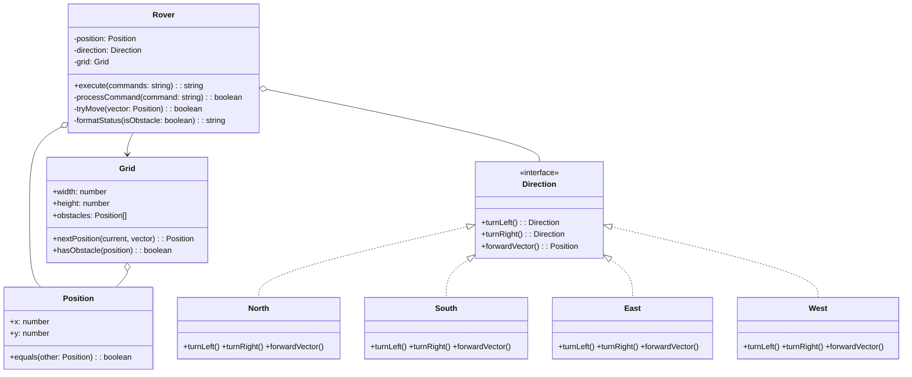
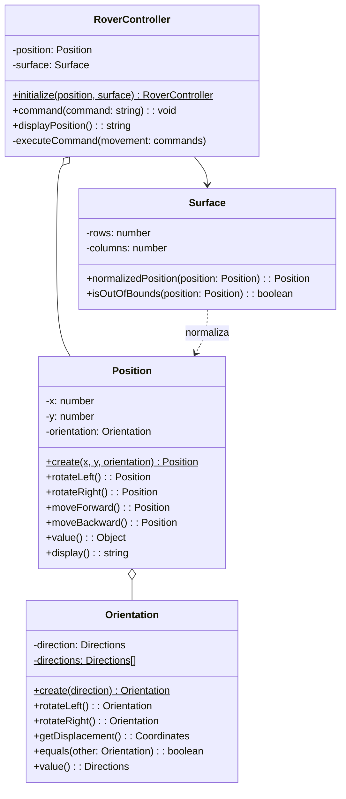

# Informe Técnico de Diseño de Software: Comparativa entre Ramas

- **Versión 1**: Rama `development-gemini-pro31` (Commit `e1514ced`)
- **Versión 2**: Rama `development-solution` (Commit `61229a3a`)

---

## 1. Resumen Ejecutivo

La comparativa entre `development-gemini-pro31` y `development-solution` presenta un contraste arquitectónico y metodológico extraordinario:

1. **`development-gemini-pro31` (Enfoque OOP Clásico & TDD Riguroso)**:
   * **Completitud Funcional**: Cumple el **100% de los requisitos del kata**, incluyendo la detección de obstáculos y el aborto de secuencia con reporte `'O:x:y:D'`.
   * **Metodología**: Desarrollada mediante **TDD canónico estricto** en micro-pasos atómicos (commits `test(red)` seguidos de `test(green)`).
   * **Diseño**: Modela la dirección mediante polimorfismo puro (patrón Estado con 4 clases concretas), pero incurre en sobreingeniería y adolece de un fallo sutil de diseño al usar reflexión sobre `constructor.name` para renderizar la dirección.

2. **`development-solution` (Enfoque Pragmático / Value Object & Test-After)**:
   * **Completitud Funcional**: **Incompleta**. **No implementa la detección de obstáculos** (requisito crítico del kata).
   * **Metodología**: Se inició mediante un commit *Big Bang* (`93b402a provide an initial solution with test in green`) y posteriores refactors. Incluye un informe de *peer-review* interno (`08d45a0`) con autocrítica de 6/10.
   * **Diseño**: Su modelado de `Orientation` con aritmética modular circular sobre un array es **mucho más limpio, elegante e idiomático en TypeScript** que la jerarquía polimórfica de V1. Sin embargo, sobrecarga `Position` convirtiéndola en una "Pose/Autómata" que asume la lógica de movimiento, y acopla sus tests unitarios al formateo en string.

---

## 2. Análisis Detallado de Diseño de Software

### 2.1. Modelado de Dirección y Rotaciones

* **`development-gemini-pro31` (Polimorfismo / Patrón Estado)**:
  * Define la interfaz `Direction` y 4 clases concretas: `North`, `South`, `East`, `West`.
  * `turnLeft()` y `turnRight()` devuelven nuevas instancias de la clase adyacente.
  * `forwardVector(): Position` encapsula el desplazamiento unitario.
  * ⚠️ **Defecto de diseño**: Para formatear el estado final, `Rover` invoca:
    ```typescript
    `${prefix}${this.position.x}:${this.position.y}:${this.direction.constructor.name.charAt(0)}`
    ```
    Confiar en `this.direction.constructor.name` es frágil: cualquier proceso de minificación o compilación de producción (Terser, esbuild, bundler) ofusca los nombres de las clases (ej. `class a`, `class b`), corrompiendo la salida esperada.

* **`development-solution` (Value Object Inmutable con Aritmética Modular)**:
  * Modela una única clase `Orientation` con un array estático de cuadrantes `['N', 'E', 'S', 'W']`.
  * Las rotaciones usan aritmética de reloj sin condicionales ni proliferación de clases:
    ```typescript
    rotateLeft()  { return new Orientation(Orientation.directions[(this.directionIndex() + 3) % 4]); }
    rotateRight() { return new Orientation(Orientation.directions[(this.directionIndex() + 1) % 4]); }
    ```
  * Los desplazamientos se obtienen vía un diccionario inmutable `getDisplacement(): Coordinates`.
  * 🟢 **Veredicto**: `Orientation` en `development-solution` es inmensamente superior: cero sobrecarga de instanciación de clases, inmutable, seguro ante minificadores y con una huella de código mínima.

---

### 2.2. Modelado de Posición y Responsabilidades (SRP)

* **`development-gemini-pro31` (Coordenada 2D Pura)**:
  * `Position` es un Value Object estricto: solo almacena `x` e `y`, e implementa `equals(other: Position)`.
  * No tiene conocimiento de rotaciones ni de direcciones. La traslación se opera sumando vectores en `Grid`.

* **`development-solution` (Sobrecarga de Responsabilidades en `Position`)**:
  * `Position` almacena `x`, `y` y además la `orientation: Orientation`.
  * Incorpora métodos `rotateLeft()`, `rotateRight()`, `moveForward()`, `moveBackward()`.
  * 🔴 **Problema de cohesión (SRP)**: `Position` ya no es una posición matemática, sino una "Pose cinemática". Además, al calcular `moveForward()`, genera una `Position` transitoria que puede estar fuera de la superficie (coordenadas negativas o fuera de escala). Es el controlador quien debe invocar a posteriori `surface.normalizedPosition(nextPosition)` para "reparar" la posición.

---

### 2.3. Topología, Superficie y Wrapping de Bordes

* **`development-gemini-pro31` (`Grid`)**:
  * `Grid(width, height, obstacles)` calcula la traslación y el wrapping de forma atómica:
    ```typescript
    nextPosition(current: Position, vector: Position): Position {
      const rawX = current.x + vector.x;
      const rawY = current.y + vector.y;
      const wrappedX = ((rawX % this.width) + this.width) % this.width;
      const wrappedY = ((rawY % this.height) + this.height) % this.height;
      return new Position(wrappedX, wrappedY);
    }
    ```
  * La fórmula `((val % max) + max) % max` es robusta para cualquier delta positivo o negativo.
  * Encapsula la detección de obstáculos: `hasObstacle(position: Position): boolean`.

* **`development-solution` (`Surface`)**:
  * `Surface(rows, columns)` solo expone `normalizedPosition` e `isOutOfBounds`.
  * Normalización: `new Position((x + this.columns) % this.columns, (y + this.rows) % this.rows, orientation)`.
  * ⚠️ **Limitación**: La fórmula `(x + cols) % cols` solo funciona para saltos de paso unitario (`-1`). Si el delta fuera menor que `-columns`, produce números negativos en JavaScript.
  * 🔴 **Omisión de Dominio**: `Surface` no conoce nada sobre obstáculos ni accidentes geográficos.

---

### 2.4. Control, Detección de Obstáculos y Principio CQS

* **`development-gemini-pro31` (`Rover`)**:
  * Orquesta la ejecución de la cadena: `execute(commands: string): string`.
  * Evalúa cada comando; si se detecta un obstáculo en la casilla de destino, **aborta inmediatamente el bucle**, no actualiza su posición y retorna `'O:x:y:D'`.
  * Si todo va bien, retorna `'x:y:D'`.

* **`development-solution` (`RoverController`)**:
  * Aplica **CQS (Command-Query Separation)** estricto:
    * `command(command: string): void` muta el estado.
    * `displayPosition(): string` consulta el estado formateado.
  * 🔴 **El conflicto con los requisitos**: Aunque CQS es un principio de diseño loable, al no retornar ningún resultado en `command()` y no tener soporte para obstáculos, no existe forma de saber si una secuencia de comandos se interrumpió a mitad ni en qué punto exacto ocurrió el bloqueo.
  * 🟢 **Aporte positivo**: Incorpora un método fábrica estático `RoverController.initialize(position, surface)` que valida los límites iniciales y lanza error si el Rover aterriza fuera de la superficie.

---

## 3. Diagramas Arquitectónicos Comparativos

### 3.1. Diagrama de Clases: `development-gemini-pro31`



---

### 3.2. Diagrama de Clases: `development-solution`



---

## 4. Tabla Comparativa de Diseño e Ingeniería

| Dimensión de Evaluación | `development-gemini-pro31` (V1) | `development-solution` (V2) | Veredicto Técnico |
| :--- | :--- | :--- | :--- |
| **Completitud del Kata** | **100%**: Movimiento, Rotación, Wrapping y **Obstáculos con reporte `O:`**. | **Incompleta**: Falta la detección de obstáculos y el reporte de aborto. | 🟢 **V1 gana rotundamente**. |
| **Diseño de Dirección** | Jerarquía polimórfica (4 clases concretas + interfaz). Usa reflexión para el display. | Clase única `Orientation` con aritmética modular sobre array. Sin reflexión. | 🟢 **V2 es mucho más limpia, segura y eficiente**. |
| **Modelado de Posición** | Value Object puro (coordenadas `x`, `y` con `equals`). Alta cohesión. | Pose híbrida (`x`, `y`, `Orientation`) con lógica de movimiento. Baja cohesión. | 🟢 **V1 respeta mejor el SRP**. |
| **Gestión de Superficie / Grid** | `Grid` integra límites, envoltura matemática robusta y obstáculos. | `Surface` solo normaliza envoltura de paso unitario. Sin obstáculos. | 🟢 **V1 es más robusta y completa**. |
| **Validación de Inicio** | No valida si la posición inicial está dentro de los límites del `Grid`. | `RoverController.initialize()` lanza excepción si aterriza fuera de la superficie. | 🟢 **V2 es más defensiva al inicializar**. |
| **Separación CQS** | Mixto: `execute()` muta y retorna reporte string. | CQS Puro: `command()` muta (`void`), `displayPosition()` consulta. | 🟢 **V2 sigue CQS** (pero no resuelve el reporte de fallos). |
| **Calidad y Aislamiento de Tests** | 18 tests organizados en 7 archivos. Aserciones basadas en estado e igualdad (`equals`). | 28 tests en 4 archivos. Tests fuertemente acoplados a strings de presentación (`displayPosition()`). | 🟢 **V1 tiene tests mejor desacoplados**. |
| **Disciplina TDD / Commits** | Canónica: Ciclo `test(red)` / `test(green)` verificable en git commit a commit. | Test-after en su origen (commit masivo inicial). Refactors en commits posteriores. | 🟢 **V1 ejemplifica la excelencia TDD**. |
| **Estructura Hexagonal del Repo** | Módulo aislado en `src/core/rover/` con su carpeta `tests/unit/`. | Ficheros dispersos en `src/core/` y tests aplanados en `src/tests/`. | 🟢 **V1 cumple las reglas del repositorio**. |

---

## 5. Crítica Técnica Honesta

### 🟢 ¿Qué hace brillante a `development-gemini-pro31`?
* **Trazabilidad TDD impecable**: El historial de git demuestra una disciplina de Extreme Programming de manual, donde cada prueba roja es respondida con la mínima implementación verde requerida.
* **Dominio completo y correcto**: No esquivó la parte difícil del problema (los obstáculos y la gestión del aborto anticipado).
* **Posición como VO puro**: Mantuvo `Position` libre de dependencias cinemáticas.

### 🔴 ¿Cuáles son los defectos de `development-gemini-pro31`?
* **Sobreingeniería en `Direction`**: Crear 4 archivos de clase para 4 letras añade complejidad innecesaria en TypeScript.
* **El pecado de la reflexión (`constructor.name`)**: En un pipeline real con minificación de código, la salida `'O:x:y:N'` se corrompe silenciosamente porque las clases se renombran en tiempo de compilación.

---

### 🟢 ¿Qué hace brillante a `development-solution`?
* **La implementación de `Orientation`**: Es una de las soluciones más concisas, elegantes y libres de ramas para rotaciones de brújula que se pueden escribir en TypeScript.
* **Validación en fábrica**: El guardián `RoverController.initialize()` que protege contra estados iniciales corruptos fuera del mapa.

### 🔴 ¿Cuáles son los defectos de `development-solution`?
* **No cumple el objetivo del kata**: Dejar los obstáculos fuera invalida la entrega como solución lista para producción. Como bien señala su propio informe de revisión interno (`08d45a0`), falta el requisito que precisamente obliga a diseñar el camino de control de flujo no feliz.
* **Acoplamiento de tests a la interfaz de usuario**: Probar reglas de dominio inspeccionando la salida de `displayPosition()` hace que cualquier cambio estético rompa 20 tests unitarios que deberían seguir pasando.
* **`Position` hace demasiado**: Calcular el movimiento dentro de `Position` y obligar al controlador a normalizar después a través de `Surface` es una fuga de responsabilidades.

---

## 6. Veredicto y Recomendación de Síntesis

Si tuviéramos que elegir una solución para producción, **`development-gemini-pro31` es la ganadora**, ya que resuelve el problema real de principio a fin, respeta la arquitectura del proyecto y garantiza la cobertura funcional completa.

Sin embargo, el **diseño ideal ("arquitectura de oro")** para esta kata sería una **síntesis** de ambas ramas:
1. Tomar la **completitud funcional, la disciplina TDD, el `Grid` con obstáculos y la `Position` pura** de `development-gemini-pro31`.
2. Reemplazar la jerarquía de 4 clases de `Direction` por la magnífica **clase `Orientation` inmutable** de `development-solution`.
3. Adoptar el **patrón fábrica defensivo `Rover.create()`** de `development-solution` para impedir la inicialización fuera de límites.
